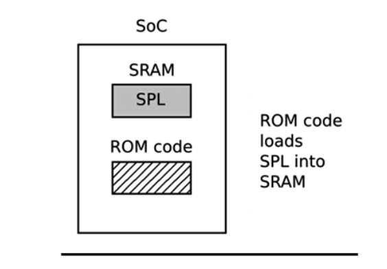
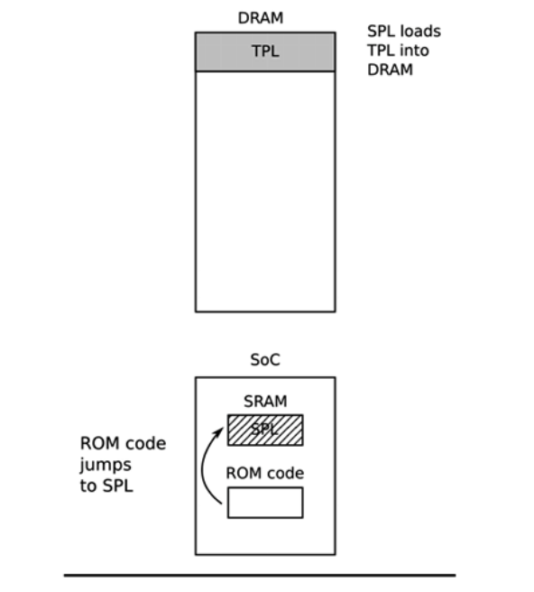

# 关于Bootloaders

Bootloader（引导加载程序）是嵌入式Linux的第二个元素。它负责启动系统并加载操作系统内核。在本章中，我们将研究Bootloader的角色，特别是它如何使用所谓设备树（也称为扁平化设备树或者FDT）的数据结构将控制权从自身传递给内核。我将介绍设备树的基础知识，因为这将帮助你遵循设备树中描述的连接将其与实际的硬件关联起来。
我将介绍流行的开源Bootloader U-Boot，并向您展示如何使用它来启动目标设备，以及如何自定义它，以便它可以在新设备上运行，以使用BeagleBone Black为例。
在本章中，我们将介绍以下主题：
- Bootloader有什么作用
- 启动顺序
- 从Bootloader转移到内核
- 设备树简介
- U-Boot

让我们开始吧！

## 技术要求
为完成本章节的示例程序，确保你满足如下要求：
- 一个基于Linux的主机系统，安装了设备树编译器、git、make、patch和u-boot-tools或等效工具
- 来自第二章“工具链学习”的适用于BeagleBone Black的Crosstool-NG工具链
- microSD 卡和读卡器
- USB转TTL 3.3V转接头
- BeagleBone Black
- 5V1A的直流电源

本章的所有代码都可以在本书的GitHub存储库的Chapter03文件夹中找到：https://github.com/PacktPublishing/MasteringEmbedded-Linux-Programming-Third-Edition。

## Bootloader是干啥的？
在嵌入式Linux系统中，bootloader主要做两件事：将系统初始化到基础状态和加载内核。事实上，第一个任务在某种程度是第二个任务的附属，因为它只需要让加载内核所需的系统工作。
当执行bootloader的第一行时，在通电或者重启之后，系统通常处于非常小的状态。DRAM控制器未设置，因此无法访问主存储器。同样，其他接口也不可用，因此不可以通过NAND闪存控制器、MMC控制器等访问的存储也不可用。通常情况下，开始阶段位唯一可用的资源是单个CPU，一些片上的静态资源和boot ROM。
系统引导程序由几个阶段的代码组成，每个阶段都会使更多的系统进行下一步运行。引导加载程序的最后一步是将内核加载到RAM中，并为其创建一个运行环境。引导加载程序和内核之间的接口细节是特定于架构的，但是不论是哪种，它都必须做两件事。首先，引导加载程序必须传递包含有关硬件配置信息的结构指针。其次，它必须将传递内核命令行的指针。
内核命令行是一个控制内核行为的文本字符串。一旦内核启动，bootloader就不需要了，它使用的内存也可以被回收了。
Bootloader的一项辅助工作是提供一种维护模式来更新启动配置，将新的启动镜像加载到内存，也可能会运行诊断程序。这通常会由一个简单的命令行用户接口来控制，常常是通过串口的。

### 启动顺序
几年前，在更简单的时代，只有一件重要的事就是将bootloader放在处理器的重置向量处的非易失性存储器中。NOR flash在当时非常常见，因为它可以直接映射到地址空间所有它是理想的存储方式。下图展示了这样的配置，重置向量在闪存的顶端0xfffffffc。Bootloader是链接的，所以在该位置有一条跳转指令，指向bootloader的开头：


从那时候起，在NOR闪存运行的bootloader可以初始化DRAM控制器使得主存储器（**DRAM**）可用，再将自身复制到DRAM中。一旦完全运行，bootloader就可以将内核从flash加载到DRAM中，并将控制权转移给它。
然而，一旦你离开了简单的线性可寻址存储介质（比如 NOR flash），启动顺序就会变成一个复杂的多阶段过程。每个SoC的细节都非常具体，但他们都会经历一下的阶段。
#### 阶段1 - ROM code
在缺乏可靠的外部存储器的情况下，重置或者通电后立即运行的程序必须存储在SoC芯片上，这也被称为ROM code。它在制造时就被加载到芯片中，因此ROM code是专有的，不能被开源代码等效取代。通常，它不包括初始化存储器控制器的代码，因为DRAM配置是高度特定于设备的，因此它只能使用不需要存储器控制器的SRAM（Static Random Access Memory）。
大多数嵌入式SoC设计都有少量的SRAM片上存储器，大小从4KB到几百KB不等：


ROM code能够将来自几个预编程位置之一的小块代码加载到SRAM中。例如，TI OMAP和Sitara试图从NAND闪存的前几页加载代码，或者从SPI（Serial Peripheral Interface）连接的闪存加载代码，或者从MMC设备的第一扇区（可以是eMMC芯片或者SD卡）加载代码，也可以从MMC设备第一分区上名为MLO的文件加载代码。如果从所有内存设备读取失败，则尝试从以太网、USB或者UART读取字节流；后来主要是作为在生产过程中将代码加载到闪存的一种方式提供的，而不是拥有以正常操作。大多数嵌入式SoC都有一类似方式工作的ROM code。在SoC中，SRAM并不够大，无法加载诸如U-Boot之类的完整bootloader，因此必须有一个称为SPL（secondary program loader）的中间加载程序。
在ROM code阶段结束时，SPL出现在SRAM中，并且ROM code跳转到SPL的开头。

#### 阶段2 - SPL
SPL必须设置内存控制器和其他重要部件，为TPL（Tertiary Program Loader）加载到DRAM做准备。SPL的功能受到SRAM大小的限制。它可以从存储设备列表中读取程序，正如ROM code一样，再次使用从闪存设备开始的预编程偏移。如果SPL内置了文件系统驱动程序，那么它可以从磁盘分区读取易读的文件名，比如u-boot.img。SPL通常不允许任何用户交互，但它可以打印版本信息和进度信息，你可以在控制台上看到这些信息。
下图解释了第2阶段的结构：


上图显示了从ROM code到SPL的跳转。当SPL到SRAM中执行时，它将TPL加载到DRAM中。在第二阶段结束后，TPL会存在在DRAM中，并且SPL会跳转到这块区域。
SPL可能是开源的，就像TI x-loader和Atmel AT91 Bootstrap的情况一样，但它们通常包含制造厂作为二进制blob提供的专有代码。

#### 阶段3 - TPL
在这个时候，我们可以运行一个完整的bootloader，例如U-Boot，我们将在本章稍后介绍它。通常这里有一个简单的命令行界面，让你可以执行维护任务，如将新的boot和内核镜像加载到闪存中，以及加载和启动内核，还有一种方法可以在无用户干预的情况下自动加载内核。
下图解释了第3阶段的结构：


上图展示了从SRAM中的SPL到DRAM的TPL的跳转。当TPL执行时，它将内核加载到DRAM中。如果需要，如果需要的话我们还可以选择将FDT和/或初始RAM附加到镜像中。无论哪种方式，当第三阶段结束后，内存中都应该有一个内核等待启动。
嵌入式bootloader通常在内核运行后就从内存里消失了，并且也不会在系统操纵中出现。在此之前，TPL需要将boot的控制权交给内核。

## 从bootloader到内核
当bootloader将控制权转移给内核的时候，它必须将一些基础的信息传递过去，包括如下内容：
- __machine number__，会被PowerPC和Arm平台在没有设备树支持的时候使用，来区分SoC的类型
- 已知的硬件信息，包括（至少应包括）物理RAM的大小和位置以及CPU的时钟速度
- 内核命令行
- 可选的，设备树二进制的大小和位置
- 可选的，初始RAM盘（initial RAM disk）的大小和位置，也被称为initial RAM file system（initramfs）

内核命令行是一个文本的ASCII字符串来控制Linux的行为，比如通过指定包含根文件系统的设备名称。我们将会在下一章节了解它的细节。常见的做法是以RAM盘提供根文件系统，在这种情况下，bootloader的责任是将RAM盘的内容载入内存。我们将在第五章“ 建立根文件系统”中讲述如何创建初始RAM盘。
这种传递信息的方式依赖于特定的架构并且在近年来也发生了变化。例如，在PowerPC，bootloader仅仅只需要传递一个板信息结构体的指针，而在Arm中，它传递一个指向A tags列表的指针。对于A tags，在内核代码的Documention/arm/Booting中有对这种格式的良好的介绍。
在这两种情况中，传递的信息量都非常有限，大部分信息都要在运行时发现或者作为平台信息硬编码到内核中。平台数据的广泛使用意味着每个板都必须为该平台配置和修改内核。需要一种更好的办法，也就是设备树。在Arm世界，随着Linux3.8的发布，从2013年2月开始真正摆脱A tags。如今，几乎所有的Arm系统都使用设备树来收集有关硬件平台细节的信息，从而允许单个内核二进制文件在各种平台运行。
既然我们已经了解了bootloader的功能、启动顺序的阶段以及它如何将控制权转移给内核，那么让我们学习如何配置bootloader，使其在流行的嵌入式SoC上运行。

## 设备树介绍
如果你正在使用Arm或者PowerPC的SoC，你几乎肯定会碰到设备树。本节旨在让你快速了解它是什么以及它是如何工作的。在本书的整个过程中，我们将反复回顾设备树的主题。
设备树是定义计算机系统硬件组成的一种灵活方式。请记住，设备树是静态数据而不是可执行代码。尽管可以将设备树与内核镜像绑定来适应无法单独加载的bootloader，但通常设备树由bootloader加载并传递给内核。
这种格式来自于Sun Microsystems bootloader也被称为OpenBoot，后来被标准化为开放固件标准也就是IEEE标准IEEE1275-1994。它被用于基于PowerPC的Macintosh计算机，因此是PowerPC Linux端的合理选择。之后，他又被许多Arm Linux实现大规模采用，并在一定范围被MIPS、MicroBlaze、ARC和其他架构采用。
我建议你去https://www.devicetree.org 了解更多信息。

### 设备树基础
Linux中包含了大量的设备树源文件在arch/$ARCH/boot/dts，并且这也是一个好的起点来学习设备树。在U-boot下的arch/$ARCH/dts下也有一小部分的源文件。如果你在第三方获得硬件，那dts是板级支持包的一部分，因此你应该与其他源文件同时收到它。
设备树将计算机系统表示为在层次结构中连接在一起的组件的集合，就像树。设备树以一个根节点开始，该根节点由正斜杠/表示，它包含表示系统硬件的后续节点。每个节点都有一个名称，并包含许多形式为name=“value”的特性。下面是一个简单的例子：
```shell
/dts-v1/;
/{
    model = "TI AM335x BeagleBone";
    compatible = "ti,am33xx";
    #address-cells = <1>;
    #size-cells = <1>;
    cpus {
        #address-cells = <1>;
        #size-cells = <0>;
        cpu@0 {
            compatible = "arm,cortex-a8";
            device_type = "cpu";
            reg = <0>;
        };
    };
    memory@0x80000000 {
        device_type = "memory";
        reg = <0x80000000 0x20000000>; /* 512 MB */
    };
};
```

