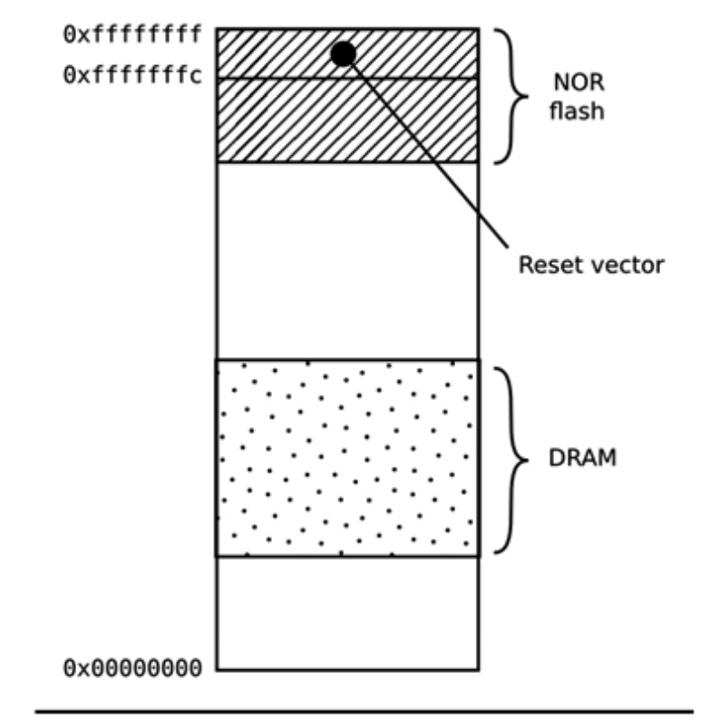

# 关于Bootloaders

Bootloader（引导加载程序）是嵌入式Linux的第二个元素。它负责启动系统并加载操作系统内核。在本章中，我们将研究Bootloader的角色，特别是它如何使用所谓设备树（也称为扁平化设备树或者FDT）的数据结构将控制权从自身传递给内核。我将介绍设备树的基础知识，因为这将帮助你遵循设备树中描述的连接将其与实际的硬件关联起来。
我将介绍流行的开源Bootloader U-Boot，并向您展示如何使用它来启动目标设备，以及如何自定义它，以便它可以在新设备上运行，以使用BeagleBone Black为例。
在本章中，我们将介绍以下主题：
- Bootloader有什么作用
- 启动顺序
- 从Bootloader转移到内核
- 设备树简介
- U-Boot

让我们开始吧！

## 技术要求
要按照示例进行操作，请确保您具有以下内容：
- 基于Linux的主机系统
- 第2章 “学习工具链”中的crosstool-NG工具链
- microSD卡读卡器和卡
- 第3章“关于引导加载程序”中安装了U-Boot的microSD卡
- USB转TTL3.3V串行电缆
- 树莓派 4
- 5V3A的USB-C电源
- BeagleBone Black
- 一个5V1A的直流电源

本章的所有代码都可以在本书的GitHub存储库的Chapter04文件夹中找到：https://github.com/PacktPublishing/MasteringEmbedded-Linux-Programming-Third-Edition。

## 内核是做什么的？
Linux始于1991年，当时Linus Tovalds开始为基于Intel 386和486的个人计算机编写操作系统。他的灵感来自4年前由Andrew S. Tanenbaum编写的Minix操作系统。Linux 在很多方面与 Minix 不同;主要区别在于它是一个 32 位虚拟内存内核，代码是开源的，后来在 GPL v2 许可证下发布。他于 1991 年 8 月 25 日在 comp.os.minix 新闻组的一篇著名帖子中宣布了这一消息，该帖子开头如下：
_Hello everybody out there using minix—I'm doing a (free) operating system (just a hobby, won't be big and professional like GNU) for 386(486) AT clones. This has been brewing since April, and is starting to get ready. I'd like any feedback on things people like/dislike in minix, as my OS resembles it somewhat (same physical layout of the filesystem (due to practical reasons) among other things)._
严格准确地说，Linus没有编写操作系统，而是编写了一个内核，内核只是操作系统的一个组件。为了创建一个带有用户空间命令和shell命令解释器的完整操作系统，他使用了GNU项目中的组件，特别是工具链，C库和基本的命令行工具。这种区别今天仍然存在，并为Linux的使用方式提供了很大的灵活性。
Linux内核可以与GNU用户空间结合使用，以创建一个在桌面和服务器上运行的完整Linux发行版，有时称为 GNU/Linux;它可以与Android用户空间结合使用以创建众所周知的移动操作系统，也可以与基于BusyBox的小型用户空间结合使用以创建紧凑的嵌入式系统。
与此形成对比的是BSD操作系统、FreeBSD、OpenBSD和NetBSD，其中内核、工具链和用户空间被组合成一个代码库。通过删除工具链，可以在没有编译器或头文件的情况下部署更精简的运行时映像。通过将用户空间与内核分离，您可以在初始化系统（runit 与systemd）、C 库（musl与glibc）和包格式（.apk与.deb）方面获得选择。
内核有三个主要工作：管理资源、与硬件接口以及提供向用户空间程序提供有用抽象级别的 API，如下图所示：

