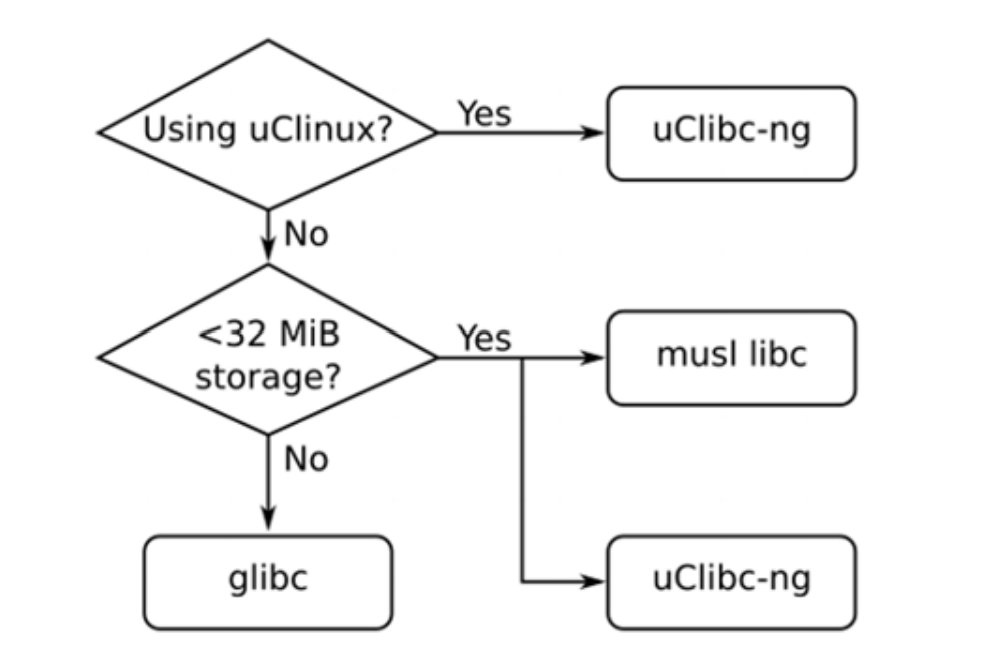

# 学习工具链
工具链是嵌入式Linux的第一个元素，也是你项目的起点。你可以使用它来编译将在你设备运行的所有代码。你在早期阶段做出的选择将对最后的结果产生深远影响。你的工具链应该能够为通过为你的处理器使用最佳的指令集来有效利用你的硬件。它应该支持你所需要的语言，并且具有可移植操作系统接口（**Portable Operating System Interface，POSIX**）和其他系统接口的可靠实现。
你的工具链应该在整个项目中保持不变。换句话说，工具链一旦选定，就需要一直使用它。项目期间编译器和开发库的不一致将会导致细微的错误。当然，如果发现有安全漏洞或者错误时还是应该更新你的工具链。
工具链的获取可以像下载和安装TAR文件一样简单，也可以像从源代码构建整个东西一样复杂。在本章中，我采用后一种方法，借助名为crosstool-NG的工具，以便展示创建工具链的详细信息。稍后，在第6章“选择构建系统”中，我将切换到使用构建系统生成的工具链，这是更常见的工具链获取的方法。当我们达到14章，从BusyBox runit开始时，我们将通过下载预构建的Linaro工具链与Buildroot一起使用来节约时间。
本章中，我们将会涉及到如下话题：
- 工具链介绍
- 寻找一个工具链
- 通过crosstool-NG工具构建一个工具链
- 剖析工具链
- 链接到库-静态链接与动态链接
- 交叉编译的艺术

## 技术要求
要按照示例进行操作，请确保您具有以下内容：
- 基于Linux的主机系统，带有autoconf、automake、bison、bzip2、cmake、flex、g++、gawk、gcc、gettext、git、gperf、help2man、libncurses5-dev、libstdc++6、libtool、libtool-bin、make、patch、python3-dev, rsync, texinfo, unzip, wget,和xz-util或者它们的等价替代。

我建议使用Ubuntu 20.04LTS或者更多版本，因为本章中的练习在撰写本文时均针对该Linux发行版进行了测试。这是在Ubuntu20.04LTS上安装所有必需软件包的命令：
```shell
$sudo  apt-get install autoconf automake bison bzip2 cmake \ 
flex g++ gawk gcc gettext git gperf help2man libncurses5-dev libstdc++6 libtool \
libtool-bin make patch python3-dev rsync texinfo unzip wget xz-utils
```

本章的所有代码都可以在本书Github存储库的Chapter02文件夹找到：https://github.com/PacktPublishing/MasteringEmbedded-Linux-Programming-Third-Edition 。

### 工具链介绍
工具链是一组可将源代码编译成可在目标设备上运行的可执行文件的工具，包括编译器、链接器和运行时库。最开始，您需要一个来构建嵌入式Linux系统的其他三个元素：bootloader、内核和根文件系统。它必须能够编译用汇编、C 和 C++编写的代码，因为这些是基本开源包中使用的语言。
通常，Linux的工具链都基于GNU（http://www.gnu.org）项目的组件，到本书写作时也是如此。然而，最近几年，**Clang**和**LLVM（Low Level Virtual Machine）** 已经发展到现在可以成为GNU工具链的可行替代。LLVM与基于GNU的工具链直接的一个主要区别是许可证，LLVM使用BSD许可证，而GNU使用GPL许可。
Clang也有一些技术优势，比如更快的编译速度和更好的诊断，与之同时GNU GCC和历史代码有良好的兼容性并且支持大类的架构和操作系统。在经历了几年的历程后，Clang现在可以编译嵌入式Linux所需的所有组件，并且是GNU的可行替代品。若要了解更多信息，请参考：https://www.kernel.org/doc/html/latest/kbuild/llvm.html。
在https://clang.llvm.org/docs/CrossCompilation.html 有一个很好的关于Clang进行交叉编译的介绍。如果您想将它用作嵌入式Linux构建系统的一部分，EmbToolkit(https://embtoolkit.org) 完全支持GNU和 LLVM/Clang工具链，并且许多人正在致力于将Clang与Buildroot和Yocto结合使用。我将在第 6 章选择构建系统中介绍嵌入式构建系统。同时，本章重点介绍GNU工具链，因为它仍然是Linux上最流行和最成熟的工具链。
一个标准的GNU工具链由三个主要部分组成：
- **Binutils**：一组实用的二进制程序，包括汇编器和链接器。它位于http://gnu.org/software/binutils。
- **GNU Compiler Collection（GCC）**：这些是C和其它语言的编译器，根据GCC的版本，包括C++、Objective-C、Objective-C++、Java、Fortran、Ada和Go。它们都使用一个共同的后端来生成汇编代码，这些代码将会被提供给GNU汇编器。它位于http://gcc.gnu.org/。
- **C库**：基于POSIX规范的标准化应用程序接口(application program interface，API)，它是应用程序与操作系统内核的主要接口。有几个C库需要考虑，我们将在本章之后看到。

除此之外，你还有需要Linux内核头文件的副本，其中包含了直接访问内核时所需的定义和常量。现在，你需要它们来编译C库，但稍后在编写与特定Linux设备交互的程序或者编译库的时候也需要它们，比如通过Linux帧缓存驱动程序显示图形。这不仅仅是在内核源代码的包含目录复制头文件的问题。这些头文件仅供在内核使用，并且包含了一些定义，如果这些定义处于原始状态编译Linux会导致冲突。
相反，您将需要生成一组经过清理的内核头文件，我在第5章构建根文件系统中对此进行了说明。
内核头文件是否从您将要使用的Linux的确切版本生成通常并不重要。由于内核接口始终向后兼容，因此只需要标头来自与您在目标上使用的内核相同或更早的内核。
大多数人会认为GNU调试器(**GNU Debugger，GDB**)也是工具链的一部分，通常在此时构建它。我将在第19章使用GDB调试中讨论GDB。
现在我们已经讨论了内核头文件并了解了工具链的组件是什么，让我们看看不同类型的工具链。

### 工具链的种类
从我们的目标考虑，总共有两种类型的工具链：
本地：此种工具链与其生成的程序在同一类型的系统（有时是同一实际系统）上运行。这是台式机与服务器上的常见情况，并且在一些种类的嵌入式设备上越来越流行。例如，运行Debian for ARM的树莓派具有自托管的本地编译器。
交叉：此工具链运行在与目标不同类型的系统，可以在台式机上快速开发，然后加载到嵌入式目标进行测试。

几乎所有嵌入式Linux开发都是使用交叉开发工具链完成的，一部分原因是大多数嵌入式设备不适合开发程序，它们缺少计算能力，内存和存储空间，而且这样可以使得主机与目标环境隔离。当目标系统与主机系统使用相同的体系结构（例如x86_64）时，第二点更加重要。在这种情况下，很容易咋主机上本地编译然后简单的将二进制文件复制到目标系统。
这在一定程度上是可行的，但是主机的发行版可能会比目标系统更频繁的进行更新，或者为目标构建代码的不同工程师使用了不同的主机开发库版本。随着时间推移，开发系统与目标系统会出现分歧，你也会违反工具链在整个项目周期应保持不变的原则。如果你可以保证主机与目标板的环境一直同步，那这种方式也是可以使用的。但是更好的办法是将主机与目标板隔离，而交叉工具链就是这样的办法。
另一方面，有一个支持本地开发的反驳观点。交叉开发产生了交叉编译目标所需的所有库和工具的负担。我们将在后面标题为交叉编译的艺术这一部分看到，交叉开发并不总是这么简单，因为许多的开源包设计时未考虑以这种方式构建。集成的构建工具，包括Buildroot和Yocto，可以通过封装规则来帮助交叉编译典型嵌入式系统中所需的一系列包。但是如果你想编译大量额外的包，本地编译可能是更好的选择。例如，使用交叉编译器为树莓派或者BeagleBone构建Debian发行版将非常困难。事实上，它们是本地编译的。
从头开始创建本地构建环境并不容易。首先你还是需要一个交叉编译器来在目标上创建本地构建环境，然后你可以使用它构建包。然后，为了在合理的时间范围内执行本地构建，你需要一个配置良好的目标板或者QEMU（Quick EMUlator）模拟目标来构建。
同时，在本章中，我将重点关注更主流的交叉编译环境，该环境相对易于设置与管理。我们将从了解一种目标CPU架构与另一种架构的区别开始。

### CPU架构
工具链必须根据目标CPU的能力来构建，其中包括以下内容：
- **CPU架构**：ARM，无内部互锁流水级的微处理器（**Microprocessor without Interlocked Pipelined Stages，MIPS**），x86_64等
- **大端或小端操作**：有些CPU可以在两种模式下运行，但每种CPU的机器码不同
- **浮点数支持**：并不是所有版本的嵌入式处理器都实现了硬件浮点单元，在这时，工具链必须配置为软件浮点库
- **应用程序二进制接口（Application Binary Interface，ABI）**：用于函数调用之间传递参数的调用约定

对于许多架构，ABI在整个处理器系列是不变的。但一个特别的例子是ARM，ARM在2000年代后期过渡到扩展应用二进制接口（**Extended Application Binary Interface，EABI**），这样以前的ABI就被称为旧应用程序二进制接口（**Old Application Binary Interface，OABI**）。虽然OABI是过时的标准，但是你还会看到对EABI的引用。此后，EABI根据浮点参数的传递方式一分为二。
最初的EABI使用通用（整数）寄存器，而较新的扩展应用程序二进制接口（**Extended Application Binary Interface Hard-Float，EABIHF**）使用浮点寄存器。EABIHF在浮点运算上明显更快，因为它消除了在整数与浮点寄存器之间的复制过程，但是它与没有浮点单元的CPU是不兼容的。这样，两种不兼容的ABI，你就必须要做出选择。
GNU在工具链中为每个工具的名称使用前缀，以标识可以生成的各种组合。它是由破折号分隔的三个或者四个组件组成的元组，如下所述：
- **CPU**：这里是CPU架构，例如ARM、MIPS或者x86_64。如果CPU有两种端模式，可以通过为小端添加的el或者大端的eb来区分。例如，小端的MIPS，mipsel，和大端的ARM，armeb。
- **供应商**：这标识了工具链的提供者。例如buildroot，poky，或unknown。有时这个组件将不被包括。
- **内核**：对我们的用途而言，内核总是Linux。
- **操作系统**：用户空间组件的名称，可能是gnu或者musl。ABI也可能附加在此处，因此对于ARM工具链，你有可能看到gnueabi、gnueabihf、musleabi或者musleabihf。

你可以使用gcc的-dumpmachine选项找到构建工具链时使用的元组。例如，你可能会在主机上看到以下内容：
```shell
$ gcc -dumpmachine
x86_64-linux-gnu
```

这个元组表示x86_64的CPU，linux的内核，gnu的用户空间。
|重要提醒：当机器上安装了本机编译器时，通常会创建指向工具链中每个工具的不带前缀的链接，以便你可以使用gcc调用C语言编译器。|
-------------

这是一个使用交叉编译器的例子：
```shell
$ mipsel-unknown-linux-gnu-gcc -dumpmachine
mipsel-unkonwn-linux-gcc
```

这个元组表示小端MIPS的CPU，未知的厂商，linux的内核，gnu的用户空间。

### 选择C语言库
Unix操作系统的编程接口是用C语言定义的，现在由POSIX标准定义。C语言库是该接口的实现，它是Linux通往内核的网关，如下图所示。即使你在用另一种语言（可能是Java或者Python）编写程序，各自的运行时支持库最终也必需调用C库，如下所示。


每当C语言库需要内核的服务时，它就会使用内核系统调用接口在用户空间和内核空间进行切换。也有一些办法可以绕过C语言库直接进行内核系统调用，但它很麻烦而且几乎总是没有必要的。
以下是几种可以选择的C语言库。主要的选项如下所示：
- **glibc**：这是一个标准的GNU C语言库，可以从https://gnu.org/software/libc 获取。它很庞大，截止目前还不易配置，但它是POSIX API的最完整实现。glibc基于LGPL2.1开源许可。
- **musl libc**：可以从https://musl.libc.org 获取。musl libc库相对较新，其作为GNU libc的轻量又符合标准的替代品受到广泛关注。对应RAM与存储有限的系统来说，这是一个不错的选择。它使用MIT许可证。
- **uClibc-ng**：可以从https://uclibc-ng.org 获取。这里的u其实是一个希腊字母mu，表示这是一个微控制器C语言库。它最初是为uClinux（没有内存管理单元的CPU的Linux）配套使用的，后来又被改写为与完整的Linux一起使用。uClibc-ng是原来的uClibc的一个fork分支，原来的那个库已经年久失修了。两者都基于LGPL2.1开源许可。
- **eglibc**：可以从http://www.eglibc.org/home 获取。现在已经过时了，eglibc是glibc的一个fork分支，经过修改后的它更适合嵌入式使用。除此之外，eglibc添加了配置选项和对glibc未覆盖的体系结构的支持，尤其是PowerPC e500 CPU。来自eglibc的代码库在2.20版本合回了glibc。eglibc不再维护。

那么，选择哪个呢？我的建议是只有在使用uClinux的时候选择uClibc-ng。在你的存储或者RAM非常有限的时候，可以选择musl libc。除此之外，请使用glibc，可以参考如下流程图：


你对C语言库的选择可能会限制你对工具链的选择，因为并非所有的预购建的工具链都支持所有C语言库。

## 寻找一个工具链
对于交叉开发工具链，你有三种选择：你肯呢个会找到符合你要求的现成工具链；你可以使用由嵌入式构建系统生成的工具链，这在第6章“选择构建系统”中有所介绍；或者你可以自己创建一个，如本章后面所述。
预构建的交叉工具链是一个很有吸引力的选择，因为你只需要下载并安装就可以了。但是这样会受限于该特定工具链的配置，并且也依赖你获取工具链的组织或个人。
通常来说，他将会是如下中的一个：
- 